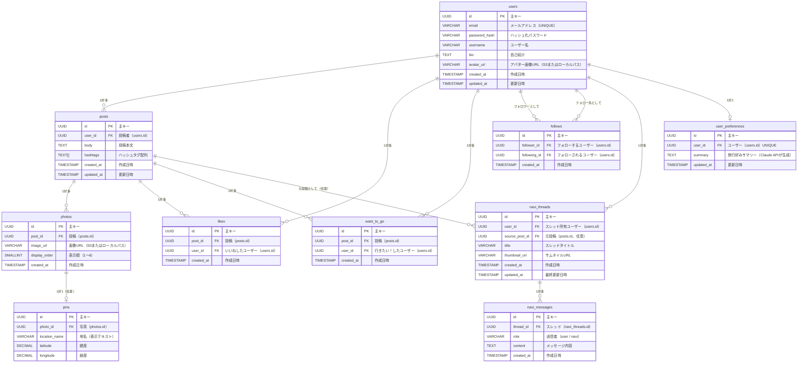

# Navilog データモデル・ER図

作成日: 2026-05-28
最終更新日: 2026-05-30

---

## 1. エンティティ概要

| テーブル名 | 概要 |
|-----------|------|
| users | ユーザー情報（認証情報・プロフィール） |
| posts | 旅行投稿（本文・ハッシュタグ） |
| photos | 投稿に添付された写真（画像URL・表示順） |
| pins | 写真に紐付く地図ピン（地名・緯度・経度） |
| likes | いいね（ユーザーと投稿の紐付け） |
| want_to_go | 行きたい！（ユーザーと投稿の紐付け） |
| follows | フォロー関係（フォロワーとフォロー先の紐付け） |
| navi_threads | ナビちゃんとの会話スレッド |
| navi_messages | スレッド内の個々のメッセージ |
| user_preferences | ユーザーの旅行好みサマリー（ナビちゃん記憶） |

---

## 2. ER図

---

## 3. リレーション一覧

| リレーション | 種別 | 説明 |
|------------|------|------|
| users → posts | 1対多 | 1人のユーザーが複数の投稿を持つ |
| posts → photos | 1対多 | 1つの投稿に最大6枚の写真が紐付く |
| photos → pins | 1対1（任意） | 1枚の写真に最大1つの地図ピンが紐付く |
| users → likes | 1対多 | 1人のユーザーが複数のいいねを持つ |
| users → want_to_go | 1対多 | 1人のユーザーが複数の行きたい！を持つ |
| users → follows（follower） | 1対多 | 1人のユーザーが複数のユーザーをフォローする |
| users → follows（following） | 1対多 | 1人のユーザーが複数のユーザーにフォローされる |
| users → navi_threads | 1対多 | 1人のユーザーが複数のナビちゃんスレッドを持つ |
| users → user_preferences | 1対1 | 1人のユーザーに1つの好みサマリーが紐付く |
| posts → navi_threads | 1対多（任意） | 「行きたい！」された投稿から複数のスレッドが生成される |
| navi_threads → navi_messages | 1対多 | 1つのスレッドに複数のメッセージが紐付く |

---

## 4. テーブル定義

### 4.1 users

| カラム名 | 型 | 制約 | 説明 |
|---------|-----|------|------|
| id | UUID | PK, DEFAULT gen_random_uuid() | 主キー |
| email | VARCHAR(255) | NOT NULL, UNIQUE | メールアドレス |
| password_hash | VARCHAR(255) | NOT NULL | BCryptハッシュ化パスワード |
| username | VARCHAR(50) | NOT NULL | ユーザー名 |
| bio | TEXT | | 自己紹介（最大160文字） |
| avatar_url | VARCHAR(500) | | アバター画像のURL（S3またはローカルパス） |
| created_at | TIMESTAMP | NOT NULL, DEFAULT NOW() | 作成日時 |
| updated_at | TIMESTAMP | NOT NULL, DEFAULT NOW() | 更新日時 |

---

### 4.2 posts

| カラム名 | 型 | 制約 | 説明 |
|---------|-----|------|------|
| id | UUID | PK, DEFAULT gen_random_uuid() | 主キー |
| user_id | UUID | NOT NULL, FK → users.id | 投稿者 |
| body | TEXT | | 投稿本文（任意、最大1000文字） |
| hashtags | TEXT[] | NOT NULL, DEFAULT '{}' | ハッシュタグ配列 |
| created_at | TIMESTAMP | NOT NULL, DEFAULT NOW() | 作成日時 |
| updated_at | TIMESTAMP | NOT NULL, DEFAULT NOW() | 更新日時 |

- **CHECK制約**: `body IS NOT NULL OR photos（関連レコード）が存在する` ※アプリ層で担保

---

### 4.3 photos

| カラム名 | 型 | 制約 | 説明 |
|---------|-----|------|------|
| id | UUID | PK, DEFAULT gen_random_uuid() | 主キー |
| post_id | UUID | NOT NULL, FK → posts.id | 紐付く投稿 |
| image_url | VARCHAR(500) | NOT NULL | 画像のURL（S3またはローカルパス） |
| display_order | SMALLINT | NOT NULL, CHECK(1〜6) | 表示順 |
| created_at | TIMESTAMP | NOT NULL, DEFAULT NOW() | 作成日時 |

---

### 4.4 pins

| カラム名 | 型 | 制約 | 説明 |
|---------|-----|------|------|
| id | UUID | PK, DEFAULT gen_random_uuid() | 主キー |
| photo_id | UUID | NOT NULL, UNIQUE, FK → photos.id | 紐付く写真（1写真に1ピンのみ） |
| location_name | VARCHAR(100) | | 地名表示テキスト（例: 京都・嵐山）（任意） |
| latitude | DECIMAL(9,6) | NOT NULL | 緯度 |
| longitude | DECIMAL(9,6) | NOT NULL | 経度 |

---

### 4.5 likes

| カラム名 | 型 | 制約 | 説明 |
|---------|-----|------|------|
| id | UUID | PK, DEFAULT gen_random_uuid() | 主キー |
| post_id | UUID | NOT NULL, FK → posts.id | いいねした投稿 |
| user_id | UUID | NOT NULL, FK → users.id | いいねしたユーザー |
| created_at | TIMESTAMP | NOT NULL, DEFAULT NOW() | 作成日時 |

- **UNIQUE制約**: `(post_id, user_id)` — 同一ユーザーが同一投稿に重複していいねできない

---

### 4.6 want_to_go

| カラム名 | 型 | 制約 | 説明 |
|---------|-----|------|------|
| id | UUID | PK, DEFAULT gen_random_uuid() | 主キー |
| post_id | UUID | NOT NULL, FK → posts.id | 行きたい！した投稿 |
| user_id | UUID | NOT NULL, FK → users.id | 行きたい！したユーザー |
| created_at | TIMESTAMP | NOT NULL, DEFAULT NOW() | 作成日時 |

- **UNIQUE制約**: `(post_id, user_id)` — 同一ユーザーが同一投稿に重複して行きたい！できない

---

### 4.7 follows

| カラム名 | 型 | 制約 | 説明 |
|---------|-----|------|------|
| id | UUID | PK, DEFAULT gen_random_uuid() | 主キー |
| follower_id | UUID | NOT NULL, FK → users.id | フォローするユーザー |
| following_id | UUID | NOT NULL, FK → users.id | フォローされるユーザー |
| created_at | TIMESTAMP | NOT NULL, DEFAULT NOW() | 作成日時 |

- **UNIQUE制約**: `(follower_id, following_id)` — 重複フォロー不可
- **CHECK制約**: `follower_id <> following_id` — 自己フォロー不可

---

### 4.8 navi_threads

| カラム名 | 型 | 制約 | 説明 |
|---------|-----|------|------|
| id | UUID | PK, DEFAULT gen_random_uuid() | 主キー |
| user_id | UUID | NOT NULL, FK → users.id | スレッド所有ユーザー |
| source_post_id | UUID | FK → posts.id | 元の投稿（行きたい！から生成の場合のみ） |
| title | VARCHAR(100) | NOT NULL | スレッドタイトル |
| thumbnail_url | VARCHAR(500) | | サムネイルURL |
| created_at | TIMESTAMP | NOT NULL, DEFAULT NOW() | 作成日時 |
| updated_at | TIMESTAMP | NOT NULL, DEFAULT NOW() | 最終更新日時 |

---

### 4.9 navi_messages

| カラム名 | 型 | 制約 | 説明 |
|---------|-----|------|------|
| id | UUID | PK, DEFAULT gen_random_uuid() | 主キー |
| thread_id | UUID | NOT NULL, FK → navi_threads.id | 所属するスレッド |
| role | VARCHAR(10) | NOT NULL, CHECK('user', 'navi') | 送信者の種別 |
| content | TEXT | NOT NULL | メッセージ内容 |
| created_at | TIMESTAMP | NOT NULL, DEFAULT NOW() | 作成日時 |

---

### 4.10 user_preferences

| カラム名 | 型 | 制約 | 説明 |
|---------|-----|------|------|
| id | UUID | PK, DEFAULT gen_random_uuid() | 主キー |
| user_id | UUID | NOT NULL, UNIQUE, FK → users.id | ユーザー（1対1） |
| summary | TEXT | | 旅行好みサマリー（Claude APIが会話から生成）（任意） |
| updated_at | TIMESTAMP | NOT NULL, DEFAULT NOW() | 更新日時 |
