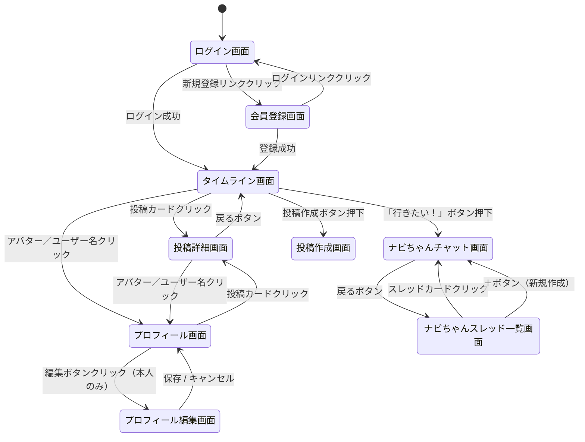

# TripDiary 画面設計書

作成日: 2026-05-28
最終更新日: 2026-05-28

---

## 1. 画面一覧

| No | 画面名 | 認証要否 | 概要 |
|----|--------|---------|------|
| 1 | ログイン画面 | 不要 | メールアドレス・パスワードでログインする |
| 2 | 会員登録画面 | 不要 | 新規アカウントを作成する |
| 3 | タイムライン画面 | 必要 | 全体／フォロー中の投稿をタブ切り替えで表示する |
| 4 | 投稿詳細画面 | 必要 | 投稿の詳細と地図ピンを表示する |
| 5 | 投稿作成画面 | 必要 | 写真・本文・ハッシュタグ・地図ピンを投稿する |
| 6 | ナビちゃんスレッド一覧画面 | 必要 | ナビちゃんとの会話スレッド一覧を表示する |
| 7 | ナビちゃんチャット画面 | 必要 | ナビちゃんと旅行プランを相談する |
| 8 | プロフィール画面 | 必要 | ユーザーのプロフィールと投稿一覧を表示する |
| 9 | プロフィール編集画面 | 必要（本人のみ） | アバター・ユーザー名・自己紹介を編集する |

---

## 2. 共通レイアウト

### 2.1 BottomTab（ログイン後全画面）

```
┌─────────────────────────────────────────────────────────┐
│                     コンテンツエリア                      │
│                                                         │
└─────────────────────────────────────────────────────────┘
┌──────────┬──────────┬──────────┐
│ 🌍       │ 👥       │ 🤖       │
│タイムライン│フォロー中 │ナビちゃん │
└──────────┴──────────┴──────────┘
```

| タブ | アイコン | 遷移先 |
|------|---------|--------|
| タイムライン | 🌍 | 全体タイムライン画面 |
| フォロー中 | 👥 | フォロー中タイムライン画面 |
| ナビちゃん | 🤖 | ナビちゃんスレッド一覧画面 |

---

## 3. 画面詳細

### 3.1 ログイン画面

```
┌──────────────────────────────────┐
│          TripDiary ✈️            │
│                                  │
│  メールアドレス                   │
│  [________________________]      │
│                                  │
│  パスワード                       │
│  [________________________]      │
│                                  │
│  [      ログイン       ]          │
│                                  │
│  アカウントをお持ちでない方は      │
│  → 新規登録                       │
└──────────────────────────────────┘
```

| 要素 | 仕様 |
|------|------|
| メールアドレス入力 | type="email"、必須 |
| パスワード入力 | type="password"、必須 |
| ログインボタン | NextAuth.jsで認証、成功でタイムライン画面へ遷移 |
| 新規登録リンク | 会員登録画面へ遷移 |
| エラー表示 | 認証失敗時にフォーム上部に「メールアドレスまたはパスワードが正しくありません」を表示 |

---

### 3.2 会員登録画面

```
┌──────────────────────────────────┐
│          TripDiary ✈️            │
│         新規アカウント登録         │
│                                  │
│  ユーザー名                       │
│  [________________________]      │
│                                  │
│  メールアドレス                   │
│  [________________________]      │
│                                  │
│  パスワード                       │
│  [________________________]      │
│                                  │
│  パスワード（確認）                │
│  [________________________]      │
│                                  │
│  [      登録する       ]          │
│                                  │
│  すでにアカウントをお持ちの方は    │
│  → ログイン                       │
└──────────────────────────────────┘
```

| 要素 | 仕様 |
|------|------|
| ユーザー名入力 | 必須、最大50文字 |
| メールアドレス入力 | type="email"、必須、重複チェックあり |
| パスワード入力 | type="password"、必須、最小8文字 |
| パスワード確認入力 | 必須、パスワードと一致チェック |
| 登録するボタン | 成功でタイムライン画面へ遷移 |

---

### 3.3 タイムライン画面

```
┌─────────────────────────────────────────────────────────┐
│  🌍 タイムライン          👥 フォロー中                  │
├─────────────────────────────────────────────────────────┤
│                                                         │
│  ┌─────────────────────────────────────────────────┐   │
│  │ [アバター] ユーザー名              投稿日時      │   │
│  │ ┌─────────────────────────────────────────────┐ │   │
│  │ │           写真（スワイプ切替）               │ │   │
│  │ └─────────────────────────────────────────────┘ │   │
│  │ 📍 京都・嵐山                                   │   │
│  │ 投稿本文テキスト                                │   │
│  │ #京都旅行  #紅葉                               │   │
│  │ ❤️ 42   ✈️ 18                                   │   │
│  └─────────────────────────────────────────────────┘   │
│                                                         │
│  （投稿カードが繰り返し表示される）                      │
│                                                         │
└─────────────────────────────────────────────────────────┘
┌──────────┬──────────┬──────────┐
│ 🌍       │ 👥       │ 🤖       │
└──────────┴──────────┴──────────┘
```

| 要素 | 仕様 |
|------|------|
| タブ（タイムライン） | 全ユーザーの投稿を新着順に表示 |
| タブ（フォロー中） | フォロー中ユーザーの投稿のみ表示 |
| 投稿カード | アバター・ユーザー名・投稿日時・写真・地名バッジ・本文・ハッシュタグ・いいね数・行きたい！数を表示 |
| 写真エリア | 左右スワイプで最大6枚切り替え、写真インジケーター（ドット）を表示 |
| 地名バッジ（📍） | 現在表示中の写真にピンが設定されている場合のみ表示 |
| いいねボタン（❤️） | クリックでいいね／取り消しを切り替え。いいね数を表示 |
| 行きたい！ボタン（✈️） | クリックで行きたい！／取り消しを切り替え。ナビちゃんスレッドを生成してチャット画面へ遷移 |
| 投稿カード全体 | クリックで投稿詳細画面へ遷移 |
| アバター／ユーザー名 | クリックでプロフィール画面へ遷移 |

---

### 3.4 投稿詳細画面

```
┌─────────────────────────────────────────────────────────┐
│  ← 戻る                                                 │
│                                                         │
│  [アバター] ユーザー名              投稿日時            │
│  ┌─────────────────────────────────────────────────┐   │
│  │           写真（スワイプ切替）                   │   │
│  └─────────────────────────────────────────────────┘   │
│  📍 京都・嵐山                                          │
│  投稿本文テキスト                                        │
│  #京都旅行  #紅葉                                       │
│  ❤️ 42   ✈️ 18                                          │
│                                                         │
│  ─────────────────────────────────────────────────     │
│  🗺 地図                                                │
│  ┌─────────────────────────────────────────────────┐   │
│  │       OpenStreetMap（写真連動ピン表示）          │   │
│  └─────────────────────────────────────────────────┘   │
│                                                         │
└─────────────────────────────────────────────────────────┘
```

| 要素 | 仕様 |
|------|------|
| 戻るボタン | ブラウザの履歴を1つ戻る |
| 投稿カード | タイムラインと同様の表示 |
| 地図エリア | Leaflet.js + OpenStreetMapで地図を表示。現在の写真に対応したピンをアクティブ表示。ピンクリックで地名ポップアップを表示 |

---

### 3.5 投稿作成画面

```
┌─────────────────────────────────────────────────────────┐
│  ← キャンセル         旅行を投稿する         [投稿する] │
├─────────────────────────────────────────────────────────┤
│                                                         │
│  写真を追加（最大6枚）                                   │
│  [＋] [写真1] [写真2] [写真3] ...                       │
│                                                         │
│  選択中の写真                                            │
│  ┌─────────────────────────────────────────────────┐   │
│  │           選択中の写真プレビュー                 │   │
│  └─────────────────────────────────────────────────┘   │
│  📍 場所を追加 [場所名を入力...]  [地図で設定]           │
│                                                         │
│  本文                                                   │
│  [旅の感想を書こう...                    ]              │
│  [                                       ]              │
│                                                         │
│  ハッシュタグ                                            │
│  [#タグを追加...]                                        │
│                                                         │
└─────────────────────────────────────────────────────────┘
```

| 要素 | 仕様 |
|------|------|
| 写真追加 | 最大6枚、写真一覧からドラッグで順番変更可 |
| 場所を追加 | 各写真に対して場所名・緯度経度を設定可。Nominatimで場所名から緯度経度を検索 |
| 本文 | 任意、最大1000文字 |
| ハッシュタグ | 任意、スペースまたはEnterで区切り、「#」は自動補完 |
| 投稿するボタン | 写真または本文のいずれかが必要 |

---

### 3.6 ナビちゃんスレッド一覧画面

```
┌─────────────────────────────────────────────────────────┐
│  ナビちゃんに相談する                              [＋] │
├─────────────────────────────────────────────────────────┤
│                                                         │
│  ┌─────────────────────────────────────────────────┐   │
│  │ [サムネイル]  京都・嵐山の旅プラン               │   │
│  │               最終更新: 5月21日                 │   │
│  └─────────────────────────────────────────────────┘   │
│                                                         │
│  ┌─────────────────────────────────────────────────┐   │
│  │ [サムネイル]  沖縄家族旅行プラン                 │   │
│  │               最終更新: 5月19日                 │   │
│  └─────────────────────────────────────────────────┘   │
│                                                         │
│  （スレッドカードが繰り返し表示される）                  │
│                                                         │
└─────────────────────────────────────────────────────────┘
```

| 要素 | 仕様 |
|------|------|
| スレッドカード | サムネイル・タイトル・最終更新日時を表示。クリックでチャット画面へ遷移 |
| ＋ボタン | 新規スレッドを作成し、チャット画面へ遷移 |
| スレッドが0件 | 「まだ相談がありません。「行きたい！」を押してナビちゃんに相談してみよう！」を表示 |

---

### 3.7 ナビちゃんチャット画面

```
┌─────────────────────────────────────────────────────────┐
│  ← 戻る         京都・嵐山の旅プラン                    │
├─────────────────────────────────────────────────────────┤
│                                                         │
│              ┌──────────────────────────────────────┐  │
│              │ 田中さくらさんの京都・嵐山の投稿、    │  │
│              │ 気になったんだね！🍁 どんな旅にしたい？│  │
│              └──────────────────────────────────────┘  │
│  [ナビ🤖]                                               │
│                                                         │
│  ┌──────────────────────────────────────┐              │
│  │  紅葉の時期に友達と2泊3日で行きたい！ │              │
│  └──────────────────────────────────────┘  [あなた]   │
│                                                         │
│              ┌──────────────────────────────────────┐  │
│              │ いいね！紅葉シーズンは11月中旬〜下旬  │  │
│              │ がベストだよ✨...                     │  │
│              └──────────────────────────────────────┘  │
│  [ナビ🤖]                                               │
│                                                         │
├─────────────────────────────────────────────────────────┤
│  [メッセージを入力...]                         [送信]   │
└─────────────────────────────────────────────────────────┘
```

| 要素 | 仕様 |
|------|------|
| メッセージ一覧 | ユーザーメッセージ（右寄せ）、ナビちゃんメッセージ（左寄せ）で表示 |
| ナビちゃんのメッセージ | ストリーミング表示（文字が流れるように表示） |
| 入力フォーム | Enterで送信、Shift+Enterで改行 |
| 送信ボタン | メッセージが空の場合はdisabled |

---

### 3.8 プロフィール画面

```
┌─────────────────────────────────────────────────────────┐
│  ← 戻る                                                 │
│                                                         │
│  ┌──────────────────────────────────────────────────┐  │
│  │  [アバター画像（大）]                            │  │
│  │                                                  │  │
│  │  ユーザー名              [フォローする] ※他人    │  │
│  │                          [プロフィール編集] ※本人│  │
│  │                                                  │  │
│  │  自己紹介テキスト                                │  │
│  │                                                  │  │
│  │  フォロー中 XX人   フォロワー XX人               │  │
│  └──────────────────────────────────────────────────┘  │
│                                                         │
│  投稿 (XX件)                                            │
│  ─────────────────────────────────────────────────     │
│                                                         │
│  （投稿カードが繰り返し表示される）                      │
│                                                         │
└─────────────────────────────────────────────────────────┘
```

| 要素 | 仕様 |
|------|------|
| アバター画像 | Supabase StorageのURLを参照して表示、未設定の場合はデフォルト画像 |
| フォローするボタン | 他ユーザーのプロフィールのみ表示 |
| プロフィール編集ボタン | 自分のプロフィールのみ表示、クリックで編集画面へ遷移 |
| フォロー中／フォロワー数 | クリックでフォロー一覧・フォロワー一覧モーダルを表示 |
| 投稿一覧 | そのユーザーの投稿を新着順で表示 |

---

### 3.9 プロフィール編集画面

```
┌─────────────────────────────────────────────────────────┐
│  ← キャンセル       プロフィール編集        [保存する]  │
├─────────────────────────────────────────────────────────┤
│                                                         │
│  アバター画像                                            │
│  [アバター画像（現在）]  [画像を変更する]                │
│                                                         │
│  ユーザー名 *                                            │
│  [________________________________]                     │
│                                                         │
│  自己紹介                                               │
│  [________________________________]                     │
│  [________________________________]                     │
│                                                         │
└─────────────────────────────────────────────────────────┘
```

| 要素 | 仕様 |
|------|------|
| アバター画像 | 現在の画像を表示、「画像を変更する」で画像選択ダイアログを開く |
| ユーザー名 | 必須、最大50文字 |
| 自己紹介 | 任意、最大160文字 |
| キャンセルボタン | プロフィール画面に戻る（変更を破棄） |
| 保存するボタン | APIを呼び出しプロフィールを更新、成功でプロフィール画面へ遷移 |

---

## 4. エラーハンドリング

### 4.1 投稿フォーム

| エラーケース | 対応 |
|-------------|------|
| 写真が未選択かつ本文が空 | 「写真または本文を入力してください」を表示 |
| 写真が7枚以上 | 「写真は最大6枚まで添付できます」を表示 |
| 写真アップロード失敗 | 「写真のアップロードに失敗しました」を表示 |

### 4.2 認証

| エラーケース | 対応 |
|-------------|------|
| ログイン失敗 | 「メールアドレスまたはパスワードが正しくありません」 |
| メールアドレス重複 | 「このメールアドレスはすでに使用されています」 |
| パスワード不一致 | 「パスワードが一致しません」 |

### 4.3 共通

| エラーケース | 対応 |
|-------------|------|
| 未認証でのアクセス | ログイン画面へリダイレクト |
| 存在しないリソース | 「ページが見つかりません（404）」を表示 |
| サーバーエラー | 「エラーが発生しました。しばらく時間をおいて再試行してください」を表示 |
| Claude APIエラー | 「ナビちゃんとの通信に失敗しました。再度お試しください」を表示 |

---

## 5. 画面遷移図


